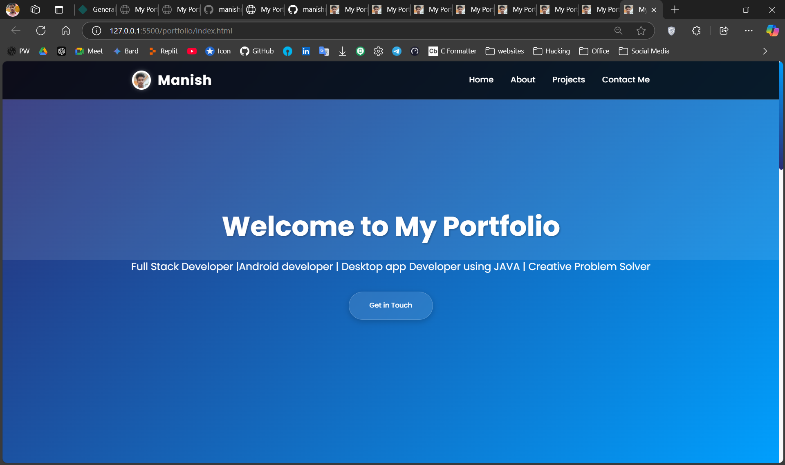
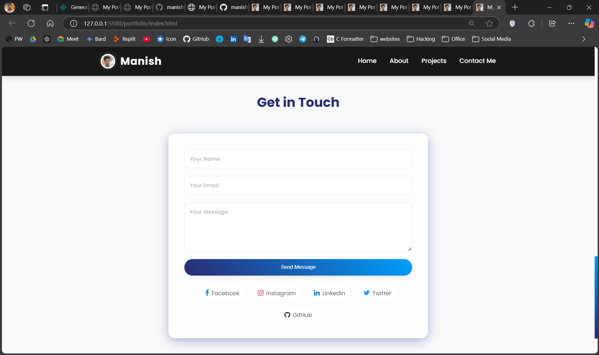

# 🌐 Portfolio Website


> A modern, responsive, and user-friendly **portfolio website** developed using React.js, CSS, and JavaScript.  
> This website showcases my **projects**, **About**, and **skills** in a clean and professional layout, optimized for all screen sizes.

---

## 🖼️ Preview

| Main Page | Help Page |
|-----------|-----------|
|  |  |

---

## 🚀 Features

✨ **Clean UI Design**  
- Visually appealing sections and layout  
- Professional and minimalistic look

📱 **Fully Responsive**  
- Optimized for desktops, tablets, and mobile devices  
- Media queries and flexible layout used

🧑‍💻 **Project Showcase**  
- Displays featured projects with GitHub and download links

📄 **Resume Section**  
- Highlight skills, education, experience

📧 **Contact / Help Page**  
- Includes contact form or help guide for visitors

🛠 **Built Using**  
- Pure React.js, CSS, and JavaScript  
- No external frameworks or libraries

---

## 🛠️ Tech Stack

| Technology | Purpose                  |
|------------|--------------------------|
| React.js   | Structure of the website |
| CSS3       | Styling and layout       |
| JavaScript | Dynamic interactions     |

---

## 📥 Download & Setup

**🔗 Clone the Repository**

```bash
git clone https://github.com/manishrnl/Portfolio.git
cd Portfolio

```

## 💡 Customization
- You can customize the content by editing:

- index.html – for homepage and main structure

- style.css – to modify colors, fonts, and layout

- script.js – for animations, menu interactions, etc.

- Replace any placeholder content (like "Your Name", "Project Name", etc.) with your personal details.

---

## 📌 Folder Structure
```bash
📁 Portfolio/
├── 📁 images/
│   ├── Main_Screen.png
│   └── Help.png
├── index.html
├── style.css
├── script.js
└── README.md
```
---

## 👤 Developed By
**Manish Kumar**
- 📧 manishrajrnl1@gmail.com
- 🔗 GitHub Profile

## ✅ License
- This project is open-source and available under the MIT License.

**📢 Feel free to fork, customize, and share your own version of this portfolio. Good luck showcasing your amazing work!**
